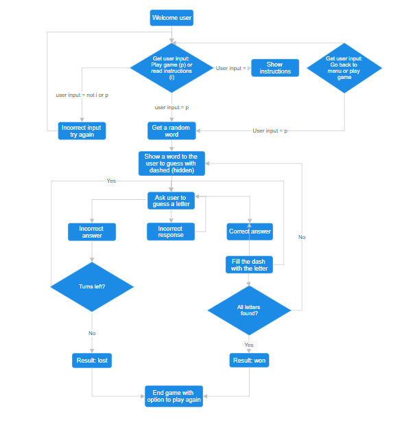

# **Hangman**

## **Introduction**

Hangman is a guessing game in which the user has to guess the word by providing letters. The game starts with all dashes. On each correct guess the dash will be replaced by the letter provided by the user. Each wrong guess will increase the failed attempts.

## **The process**

## **Libraries**

The libraries that were imported during the project are: 
* random: To get a random word back for the secret word.
* colorama: For the colors and the styling
* os (operating system): For the function to clear the console.

## **Functions explained**

### **Welcome**

* Welcomes the user to the Hangman game with a personalised message
* ASCII art is used to make the game more appealing. The following link has been used:

[ASCII Art](https://textkool.com/en/ascii-art-generator?hl=default&vl=default&font=Lil%20Devil&text=Hangman)

* The ASCII art color has been changed by importing the colorama library. The forground color has been imported.

### **Menu**

* Gives the user two options: read instruction or directly play game. 
* User can either provide i or p as an input. If the input is different than these two options the user will be looped around to answer the question with one these options only. For this part a while loop has been made and the invalid_response variable has been set to True. This value changes if the correct response has been provided.

### **Instruction**

* In this function some print statement are written to print the instructions.
* User can read the instructions
* The user gets the option to start playing the game or navigate back to the menu. 

### **Play**

* Runs the following two functions:
    * secret_word = get_random_word(): To get a random word and save it under the variable secret_word
    * validate_user_response(secret_word): Takes the secret_word as a parameter and runs the function to validate the user response.

### **get_random_word**

* Provides a list of words for the game
* Returns one random word from the list above as the secret_word using the library random

### **validate_user_response**

* Takes the secret word as a parameter.
* Converts it to an iterable array
* Replaces the letter by a dash
* Represents the dashes to the user 
* Prints statements about how long the word is and asks user for its input in alphabetic letters
* Checks user input on the following conditions:
    * If input has been guessed before. In this case the user gets an array back of all the words that are guessed before.
    * If a input is blank. User gets back that the input is invalid and he/she should try again
    * If the provided input is not in the alphabet. User gets back that this input is not in the alphabet, therefore invalid.
    * If the user input length is not equal to 1. The user gets back that the input is invalid.
    * If input is correct, iterate through (by enumerate) the dashes in the word and replace the dash by the provided input. Also, checks if all letters of the hidden value match the characters. If all letters are found, then the result_win function is triggered.
    * If a wrong letters is guessed the letters is added with append to the array of the guessed letters. The failed attempt counter is increased by 1. 
* The conditions are checked in a while loop with a counter of failed attempts. If the failed attempt reaches the maximum the user loses the game and the result_fail with the parameter word runs.

### **result_fail**

* Takes the parameter word from the validate_user_response
* Prints statements to let the user know that he/she failed to guess the right word and shows the right word to the user.
* Navigates back to the menu to give the user the option to play again.

### **result_win**

* Prints statements to let the user know that he/she won.
* Navigates back to the menu to give the user the option to play again.

### **clear_console**

* Function written to clear the console to keep the output clean.
* Function used throughout the code were the need is.
* The code behind this function comes from: [Delftstack](https://www.delftstack.com/howto/python/python-clear-console/)

## **Styling**

* Colors were used to make the console look more interactive and make the notifications clear. Red for a wrong anwer, green for a right answer and other feedback is marked with yellow.

### **Issues**

* After changing the colors with "colorama fore" the next line took over the same color. I did not want this to happen and avoid retyping the same code. After some Google research I added colorama.init(autoreset=True) to the code. Because of this I was able to make sure that the styling does not go automatically to the next line. For this part I have used the url: [Colorama](https://pypi.org/project/colorama/)
* Ending the game when all letters are found with the result win was causing me some issues. I added a variable with a count. On each correct answer I added + 1. The add was happening. Finally, I compared the count of correctly guessed with the length of the secret word and I was hoping the game to be ended there. This worked until I got a word with twice the same letter. In this case the count increased with 1 instead of 2 letters. And it never reached the length of the secret word. As a solution and better option I compared the hidden value array with the characters arrays and if they both are the same then the user wins the game.
* I was using the alphabet written out on the place I wanted to make a check if the correct input is given by the user. I changed this to the inbuilt functionality isalpha()
* Characters were taken and showing the correct result. However, the dashes were not updating with the guessed letter. To solve this issue I had to Google and I came to a solution to use enumerate and join. This solved my issue. This is the URL were I found the solution: [Stackflow replacing dashes](https://stackoverflow.com/questions/57204695/replace-underscore-with-correct-guess-letter-python-hangman)

## **Deployment**

## Reminders

- Your code must be placed in the `run.py` file
- Your dependencies must be placed in the `requirements.txt` file
- Do not edit any of the other files or your code may not deploy properly

## Creating the Heroku app

When you create the app, you will need to add two buildpacks from the _Settings_ tab. The ordering is as follows:

1. `heroku/python`
2. `heroku/nodejs`

You must then create a _Config Var_ called `PORT`. Set this to `8000`

If you have credentials, such as in the Love Sandwiches project, you must create another _Config Var_ called `CREDS` and paste the JSON into the value field.

Connect your GitHub repository and deploy as normal.
