# **Hangman**

## **Introduction**

Hangman is a guessing game in which the user has to guess the word by providing letters. The game starts with all dashes. On each correct guess the dash will be replaced by the letter provided by the user. Each wrong guess will increase the failed attempts.

## **The process**

## **Libraries**

The libraries that were imported during the project are: 
* random: To get a random word back for the secret word.
* colorama: For the colors and the styling
* os (operating system): For the function to clear the console.

## **Functions explained**

### **Welcome**

* Welcomes the user to the Hangman game with a personalised message
* ASCII art is used to make the game more appealing. The following link has been used:

[ASCII Art](https://textkool.com/en/ascii-art-generator?hl=default&vl=default&font=Lil%20Devil&text=Hangman)

* The ASCII art color has been changed by importing the colorama library. The forground color has been imported.

### **Menu**

* Gives the user two options: read instruction or directly play game. 
* User can either provide i or p as an input. If the input is different than these two options the user will be looped around to answer the question with one these options only. For this part a while loop has been made and the invalid_response variable has been set to True. This value changes if the correct response has been provided.

### **Instruction**

* In this function some print statement are written to print the instructions.
* User can read the instructions
* The user gets the option to start playing the game or navigate back to the menu. 

### **Play**

* Runs the following two functions:
    * secret_word = get_random_word(): To get a random word and save it under the variable secret_word
    * validate_user_response(secret_word): Takes the secret_word as a parameter and runs the function to validate the user response.

### **get_random_word**

* Provides a list of words for the game
* Returns one random word from the list above as the secret_word using the library random

### **validate_user_response**

* Takes the secret word as a parameter.
* Converts it to an iterable array
* Replaces the letter by a dash
* Represents the dashes to the user 
* Prints statements about how long the word is and asks user for its input in alphabetic letters
* Checks user input on the following conditions:
    * If input has been guessed before. In this case the user gets an array back of all the words that are guessed before.
    * If a input is blank. User gets back that the input is invalid and he/she should try again
    * If the provided input is not in the alphabet. User gets back that this input is not in the alphabet, therefore invalid.
    * If the user input length is not equal to 1. The user gets back that the input is invalid.
    * If input is correct, iterate through (by enumerate) the dashes in the word and replace the dash by the provided input. Also, checks if all letters of the hidden value match the characters. If all letters are found, then the result_win function is triggered.
    * If a wrong letters is guessed the letters is added with append to the array of the guessed letters. The failed attempt counter is increased by 1. 
* The conditions are checked in a while loop with a counter of failed attempts. If the failed attempt reaches the maximum the user loses the game and the result_fail with the parameter word runs.

### **Result**

I had two classes: result_win and result_fail. After testing and improving the code I have removed both classes. Instead I have added the class result. Reason for this as learnt this in the lesson args and kwargs, both the functions were very identical. To make the code more readable and for future maintainence I added a boolean in the validate_user resonse name result_win. The variable is set on True if the user wins and and False if the user fails to guess the correct answer. This variable is passed as a parameter to the result function. This function prints statement win or fail based on the variable outcome. 

* Takes three parameters from the validate_user_response: result game, attempt and correct answer
* Prints statements to let the user know that he/she won or lost the game based on if the the parameter result_game is True or False.
* Displays the final status of the hangman. Had to reprint this in this function, because of the clear console messages. 
* Shows the correct answer based on the parameter that comes from the validate_user_response function.
* Navigates back to the menu to give the user the option to play again.

### **clear_console**

* Function written to clear the console to keep the output clean.
* Function used throughout the code were needed.
* The code behind this function comes from: [Delftstack](https://www.delftstack.com/howto/python/python-clear-console/)

## **Styling**

* Colors were used to make the console look more interactive and make the notifications clear. 
    * Red for a wrong anwer
    * Green for a right answer
    * Other feedback is marked with yellow
    * The win and the lose are noted in magenta

* The cyan color is used for the title, the display of the hangman and the dashes/word to guess.
* For the background the lay-out.html file is used. A cyan colored background is used to make the look and feel better.
* A favicon has been used which displays a hanging icon.

## **Game content**

### **Start**
The game starts with the Hangman title and the welcome message. It asks for the user name.  

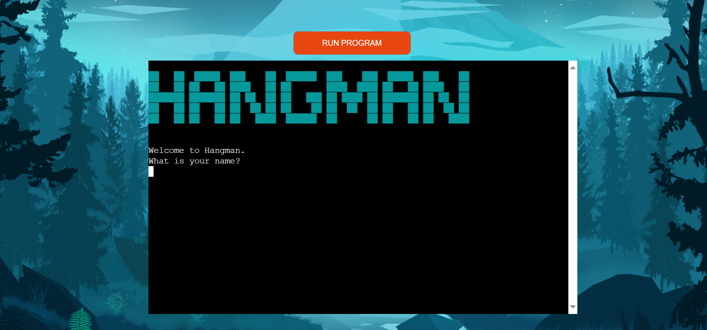

### **Menu**
The user has to give a name. If the user gives a name, the user is navigated to the menu. 
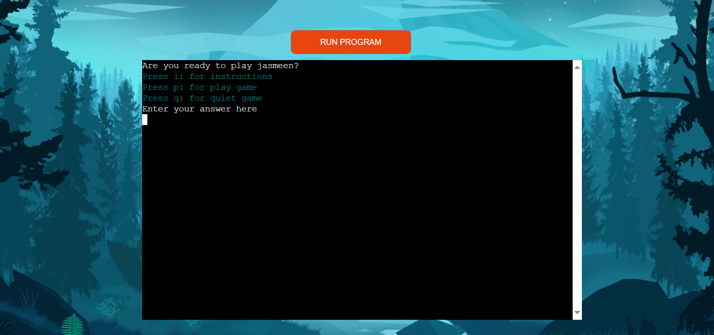

If the user leaves the name empty, the user gets a validation error.  

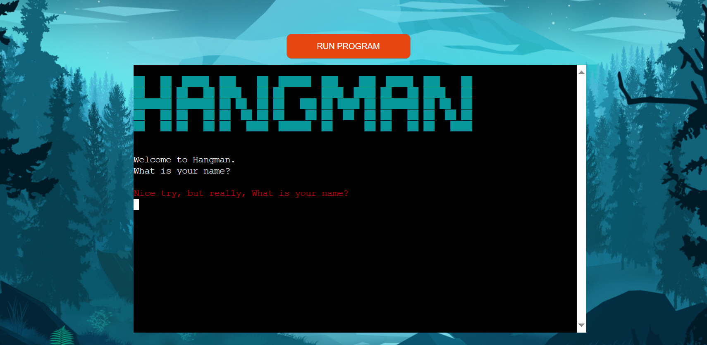

The menu shows three options:
* On press of the letter p the user is directly navigated to play the game - play-screen
* On press of the letter i the user is navigated to read the instructions - instructions-screen
* On press of the letter q the user is navigated to the start-screen with the Hangman logo and the welcome message. 

### **Instructions**
In this screen the user can read instructions. The user also get the option to play or quit the game and is referred back to the menu. The validation message occurs when a wrong input is given from the menu function itself.  

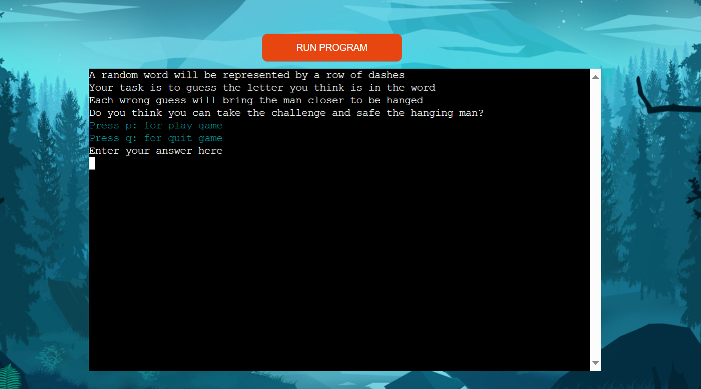

### **Play and validate response**

When the game starts the user get a row of dashes presented with the hangman display and a text to start guessing a word. The input allows the user to enter a letter. 

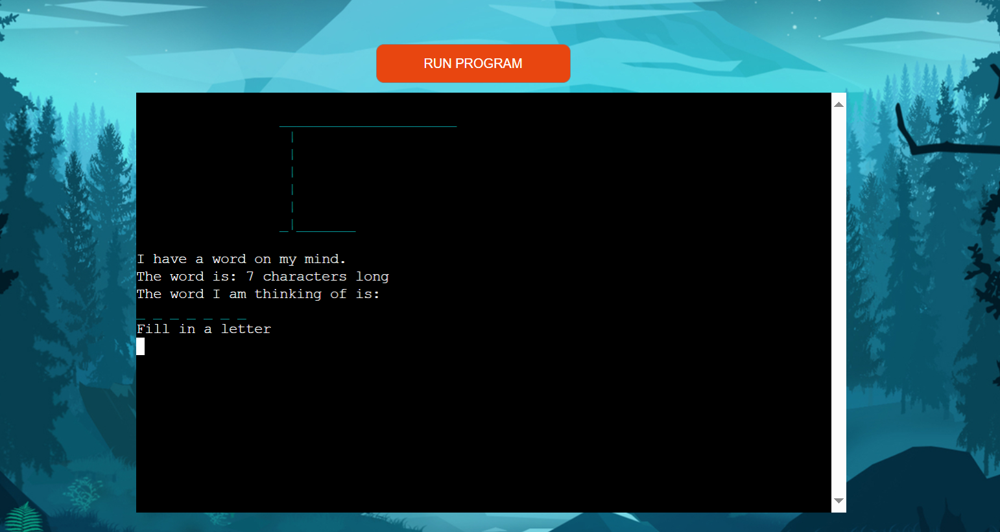  

On each letter input from the user the validation is done. This happens until the user has not won or is not over its failed attempts. The Hangman is displayed throughout.

Correct answer  
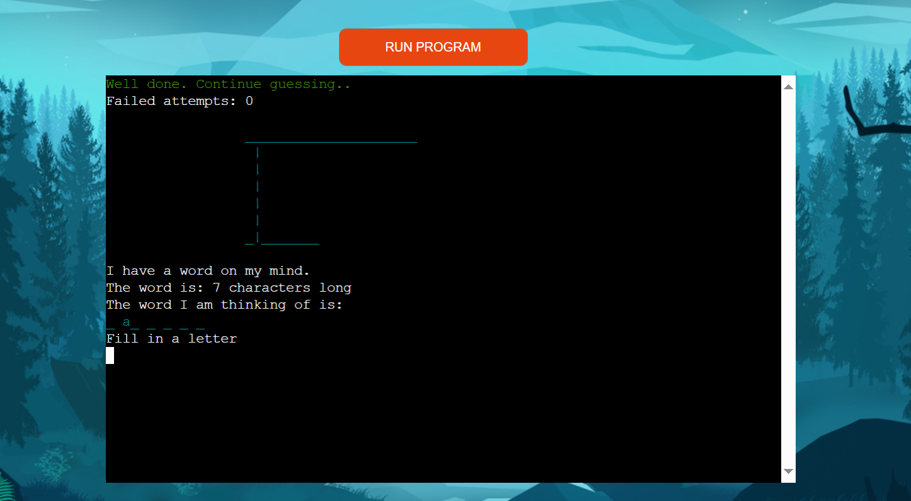

Incorrect answer  
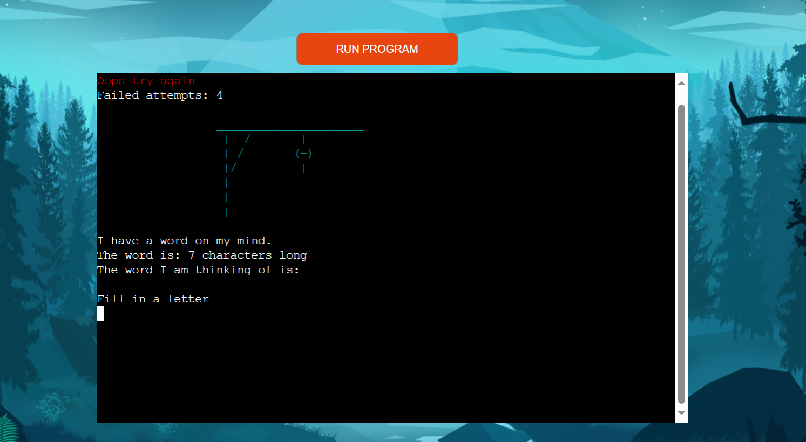

Blank value  
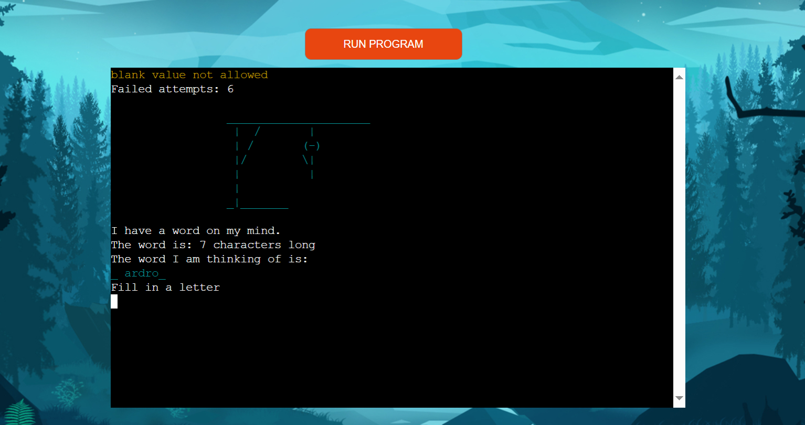

Multiple values  
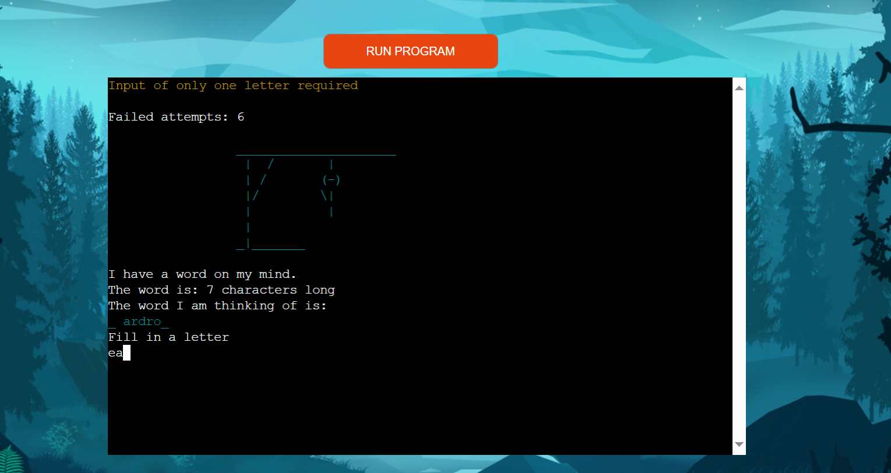

Non-alphabet value  
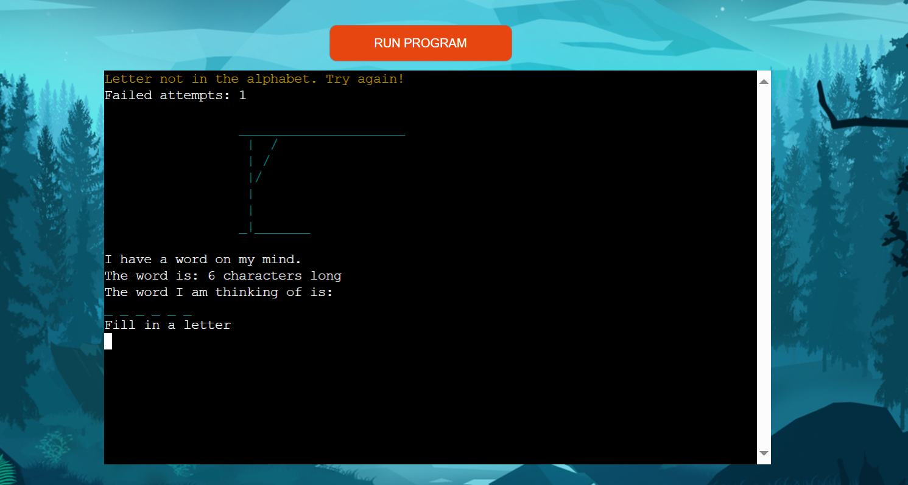

Guessed before value  
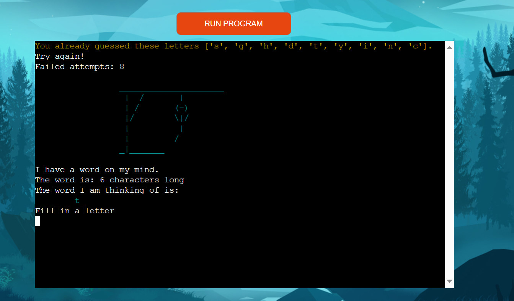

If the user guesses the right answer the user is navigated to the result of the game with the status won. If the user attemps are over and the man is hanged the user is navigated to the same result function with the status lost.

### **Result game**

The user can either win the game if the correct word is guessed. Or lose if the the attempts have reached the maximum.

In both cases the right answer is shown with some text and number of the failed attempts with the hangman displayed.

Win  
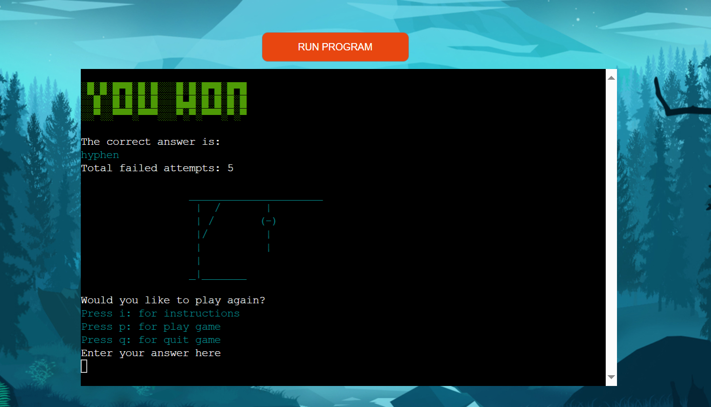  

Lost  
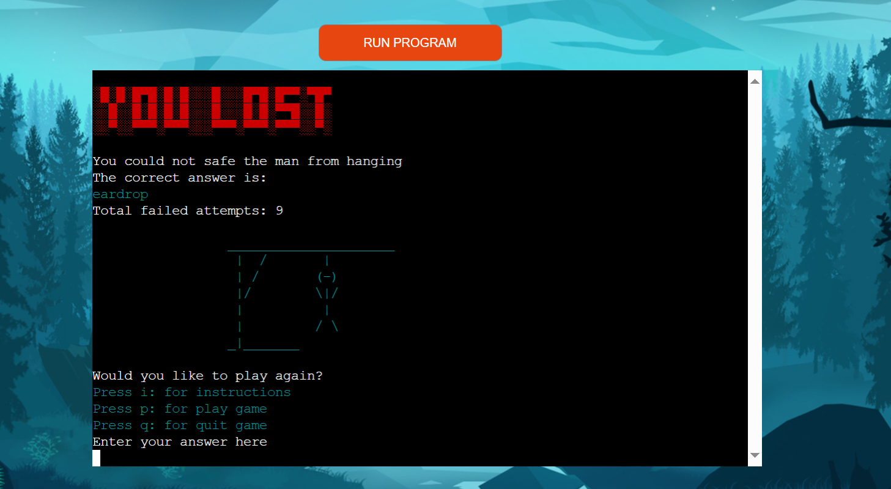  

## **Deployment**

The following deployment steps were followed:

1. I added a new line chararacter behind each input text in order to make the code work correctly.
2. I added the dependencies in the requirements.txt file with the command pip freeze > requirements.txt. After adding the dependencies I pushed the changes to the GitHub file.
3. I created a Heroku account and added my student credits on it so that my account is ready for deployments.

In Heroku I followed the following steps:
1. Create new app.
2. As the app name I chose for hangman-hangman as most of the combinations were already used prior and this name should be unique.
3. As region I chose for Europe then I clicked on create app and I went to the settings.
4. In the settings I added:
    * The config variable: Port 8000 to access the port.
    * The buildpacks: heroku/python and heroku/nodejs.
5. In the deploy section I chose for GitHub as the the deployment method.
    * After connecting to my GitHub repository I selected my project for the Hangman
    * I selected for the automatic deployment option so my deployments happens automatically on every push from GitHub.
6. The deployment went smooth and all dependencies were loaded. I got a url to host my project. This is the url [Hangman](https://hangman-hangman-1987c455a44a.herokuapp.com/)

### **Bugs and fixes**

* After changing the colors with "colorama fore" the next line took over the same color. I did not want this to happen and avoid retyping the same code. After some Google research I added colorama.init(autoreset=True) to the code. Because of this I was able to make sure that the styling does not go automatically to the next line. For this part I have used the url: [Colorama](https://pypi.org/project/colorama/)
* Ending the game when all letters are found with the result win was causing me some issues. I added a variable with a count. On each correct answer I added + 1. The add was happening. Finally, I compared the count of correctly guessed with the length of the secret word and I was hoping the game to be ended there. This worked until I got a word with twice the same letter. In this case the count increased with 1 instead of 2 letters. And it never reached the length of the secret word. As a solution and better option I compared the hidden value array with the characters arrays and if they both are the same then the user wins the game.
* I was using the alphabet written out on the place I wanted to make a check if the correct input is given by the user. I changed this to the inbuilt functionality isalpha()
* Characters were taken and showing the correct result. However, the dashes were not updating with the guessed letter. To solve this issue I had to Google and I came to a solution to use enumerate and join. This solved my issue. This is the URL were I found the solution: [Stackflow replacing dashes](https://stackoverflow.com/questions/57204695/replace-underscore-with-correct-guess-letter-python-hangman)
* Added the lowercasing for making it capital input recognize
* Added the strip functionality so that no empty string can be passed as the name
* Added the function clear_console to delete loads of texts.

## **Testing**

### **Manual testing**

|Screen       |Expectation                     |Outcome|Changes made       |Final result|
|-------------|--------------------------------|-------|-------------------|--------------|
|Home |Displays the Hangman logo |Yes| |Yes|
|Home |Welcomes the user |Yes| | Yes|
|Home |Asks for user input |Yes| |Yes|
|Home |Validates the input|No |Added a while loop and a strip method to validate the user response|Yes|
|Menu|Shows menu options to the user |Yes||Yes|
|Menu|Navigates to the selected option|Yes||Yes|
|Menu|Validates user input on capital letter|No|lower case has been used to validate the capital letter|Yes|
|Menu| Show validation message incorrect input|No| Validation message was present, but not shown due to the call to clear-console function. Moving the clear-console message above the validation message solved the issue.|Yes|
|Instructions|Shows the instructions|Yes||Yes|
|Instructions|Shows the options to play or quit| Yes | This was also showing the instructions as an option. As the user is already in the instructions I changed the print statements on several places. After incorrect input from the user, the user sees all three options with a validation error|Yes|
|Play game|Hangman is displayed|Yes||Yes|
|Play game|word is displayed as dashes|Yes||Yes|
|Play game|User can insert input|Yes||Yes|
|Play game|Validation on correct answer|Yes||Yes|
|Play game|Validation on incorrect answer|Yes||Yes|
|Play game|Validation on letter not in alphabet|Yes||Yes|
|Play game|Validation on blank answer|Yes||Yes|
|Play game|Validation on multiple letters|Yes||Yes|
|Play game|Validation on input provided before with all letters that have been provided before|Yes||Yes|
|Play game|Validation on more than one value passed|No|I was using .lenth this was not checking the length of the value provided. After some search I came to know that I had to use len() instead|Yes|
|Play game|Hangman updating on each incorect response|Yes||Yes|
|Play game|Word updating on each correct response|Yes||Yes|
|Play game|Validation messages shows correctly|No|I cleared console after execution of the while loop. This caused that the validation messaged were directly deleted and user would not get the validation response. I added the clear console message on each validation elif statement. So that the last validation message is always shown on the screen|Yes||Yes|
|Play game|Right messages shown|No|After the last failed attempt the hangman would not be shown as the while loop is not triggered with the end state. The user would directly be navigated to the result. To solve this I added a print message in the result so the last leg would be visible on lost and the hangman would be complete|Yes||Yes|
|Play game|Game ends if the failed attemps reaches the maximum and the display hangman is completed with a lost message|Yes||Yes|
|Play game|Game ends if the user has guessed the word correctly with a win message|Yes||Yes|
|End game|The correct win or lose message is shown|Yes||Yes|
|End game|User get the option to play again or end the game|Yes||Yes|

### **Automated testing**

Flake8 is used throughout the project. It has helped me to recognize indention, extra spaces or print statements which exceed the characters. These issues have been resolved througout by adding/deleting the extra spaces and solving indention faults. Also, the length of the print statements have been reduced on some places.

